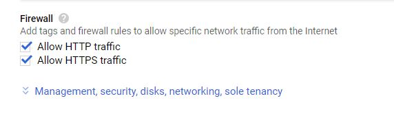
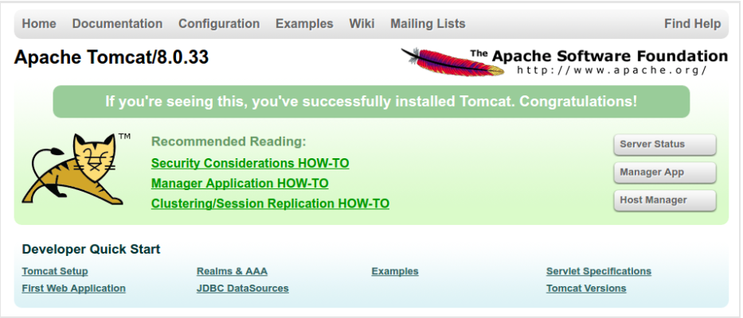
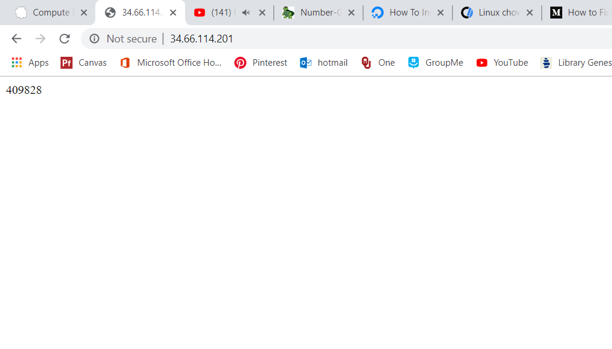

# Implementing a random number generator in java with Apache Tomcat

## 1. Create a compute engine instance with the Google Cloud Platform

The server you will be making will be hosted on a virtual machine through the Google cloud platform. To be able to use G
oogle Cloud, you will need to create an account beforehand.

Once you have created an account, you are ready to create an instance of a virtual machine. Navigate to the Compute Engine tab on the side bar, and then click on create instance at the top.

On this page, you will configure the settings for your virtual machine. Make sure that you choose an Ubuntu machine.


You will also want the firewall to allow http and https traffic.



Once you have created your instance, you need to start your instance by going to the compute engine page, selecting your instance, and clicking start at the top. Once you have done this, click on the 3 dots by your instance, and click "open in browser window" to enter your instance.


## 2. Install Apache Tomcat

Here's a detailed tutorial on how to install Apache Tomcat on an Ubuntu machine: https://www.digitalocean.com/community/tutorials/how-to-install-apache-tomcat-8-on-ubuntu-16-04


## 3. Install nginx

Here's a tutorial on how to install nginx and use it as a reverse proxy: https://www.keycdn.com/support/nginx-reverse-proxy


At the end of this step, opening a browser window and navigating to http://{your-external-ip-address} should bring up the java tomcat splash page.



## 4. Edit index.jsp

Now it's time to implement the number generator. Navigate to /opt/tomcat/latest/webapps/ROOT in your VM and edit the index.jsp file. This file is a .jsp file, which means it's in a language for java serverlets. Erase the contents of this file, and add the following line of code to generate a random number each time the webpage is visited.

```<% (int) Math.floor(Math.random() * 1000000)%>```

This line of code will generate a random int between one and a million.

Now, when you visit http://{your-external-ip-address} you should see a random number.


